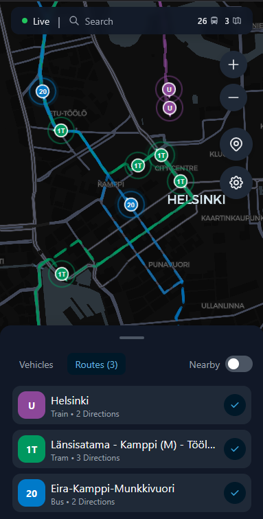

# BusMap Helsinki

Real-time Helsinki public transport vehicle tracker. Track buses, trams, metros, trains, and ferries live on the map.

**Live:** https://busmap.netlify.app



## Features

- 🚌 **Real-time vehicle tracking** - See vehicles move on the map in real-time via HSL's MQTT feed
- ⭐ **Saved routes mode** - Track your favorite routes and they'll load automatically when you open the app
- 📍 **Nearby mode** - Discover all vehicles in your current area
- 🗺️ **Smooth WebGL map** - Powered by MapLibre GL JS for 60fps animations
- 📱 **Mobile-first PWA** - Install as an app on your phone
- 🌙 **Dark mode** - Automatic or manual theme switching
- ⚡ **Fast startup** - Cached routes load instantly

## Setup

### Prerequisites

1. Register for a Digitransit API key at https://portal-api.digitransit.fi/
2. Node.js 18+ installed

### Development

```bash
# Install dependencies
npm install

# Create .env file with your API key
cp .env.example .env
# Edit .env and add your VITE_DIGITRANSIT_API_KEY

# Start development server
npm run dev
```

### Production Build

```bash
npm run build
npm run preview
```

## Technology Stack

- **Frontend:** React 18, TypeScript
- **Build:** Vite
- **Maps:** MapLibre GL JS + react-map-gl
- **Styling:** Tailwind CSS
- **State:** Zustand
- **Animations:** Framer Motion
- **Real-time:** MQTT.js (HSL HFP feed)
- **API:** Digitransit GraphQL API
- **PWA:** Workbox via vite-plugin-pwa

## API Notes

- **MQTT feed (mqtt.hsl.fi):** Free, no authentication required. Provides real-time vehicle positions.
- **Digitransit Routing API:** Requires registration and API key. Used for route list and polylines.

## License

MIT
